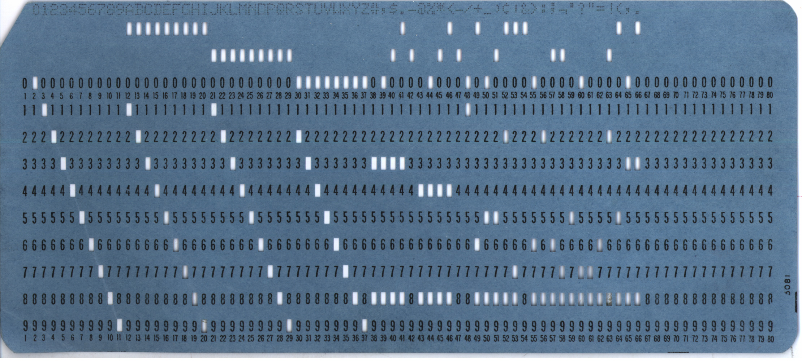

```{r setup, include=FALSE}
options(htmltools.dir.version = FALSE)
```

# BC Stats


---

# What we do


---


# Why code?


## Reproducible workflow

>Saves time,
>Produces better science,
>Creates more trusted research,
>Reduces the risk of errors, and
>Encourages collaboration.
- David Smith, [Reproducible Data Science with R](https://blog.revolutionanalytics.com/2017/04/reproducible-data-science-with-r.html)

???

David Smith, 2017-04-21, [Reproducible Data Science with R](https://blog.revolutionanalytics.com/2017/04/reproducible-data-science-with-r.html)

Hilary Parker, [“Opinionated Analysis Development”](https://peerj.com/preprints/3210/), 2017-08-31

* Reproducible and Auditable

* Accurate

* Collaborative


---

# Workflow and functionality: 1


---

# Workflow and functionality: 2


---


???

Twitter: #rstats

R-bloggers.com

Meetup groups 

RLadies

Reading:

Julia Stewart Lowndes, 2019-12-10, [Open Software Means Kinder Science](https://blogs.scientificamerican.com/observations/open-software-means-kinder-science/), _Scientific American_ blog

---


Base R

* a data science / statistics programming language

* built-in analytic functions


---

# packages

Packages extend the functionality of R

* statistical and data analysis

* data visualization

* data


---


---


# RStudio

IDE (interactive development environment)

* also the company that developed and supports the IDE

* RStudio is also active creating and supporting packages, including...


---

# The Tidyverse


???

Image source: https://github.com/rstudio/hex-stickers (for all tidyverse hex images)

---


# {tidyverse}

"The tidyverse is an opinionated collection of R packages designed for data science. All packages share an underlying design philosophy, grammar, and data structures."

The [{tidyverse} site](https://tidyverse.org): tidyverse.org


---

# An analogy...

Base R is like the engine and frame of a car


---

..the packages are the other things that enhance the car's functions


---

...and RStudio is the dashboard and controls


---

(more like this)


---

(dark mode!)


---

class: inverse

EXAMPLES


---

astronomy


???

http://www.sr.bham.ac.uk/~ajrs/R/r-gallery.html

This shows the spatial distribution of galaxies in the cluster Abell 85, using data from the NASA Extragalactic Database (NED). Overlaid are contours of kernel-smoothed number density, plotted using alpha blending (semi-transparency). Also included is an inset plot of the 1 dimensional kernel-smoothed redshift distribution, with the same colours as used in the main plot, which also serves as a key for the colour-code; the dashed curve is a Gaussian distribution with the same mean and standard deviation as the galaxy redshifts


---


class: inverse

# RStudio Cloud

Web-based version of R & RStudio

[Link](https://rstudio.cloud/spaces/34702/join?access_code=lr5keQ5WXcZ5ENNAZoLEAmPSQHav8seVNT2j36e%2F) (but will be invitation-only after today's class)

* later today, we'll run through the steps to install R on your own computer


---
class: inverse


# Text book

.pull-left[

Hadley Wickham & Garrett Grolemund, _R for Data Science_

* website: [r4ds.had.co.nz](https://r4ds.had.co.nz/)
]

.pull-right[


]

---
class: inverse


## Collaboration & community

IRL we work together

"To teach is to learn twice"

The R user community:

* welcoming & non-judgemental

* twitter #rstats

* in-person: conferences & user groups

* RLadies

* hex stickers!


---
class: inverse


## About me


* UVic Geography B.Sc. & M.A.

* BC Stats: 1993–present (with 5 year gap)

* writing code 
  - first programming course in 1979/80
  - to do data analysis since 1993
  - using R since 2012




