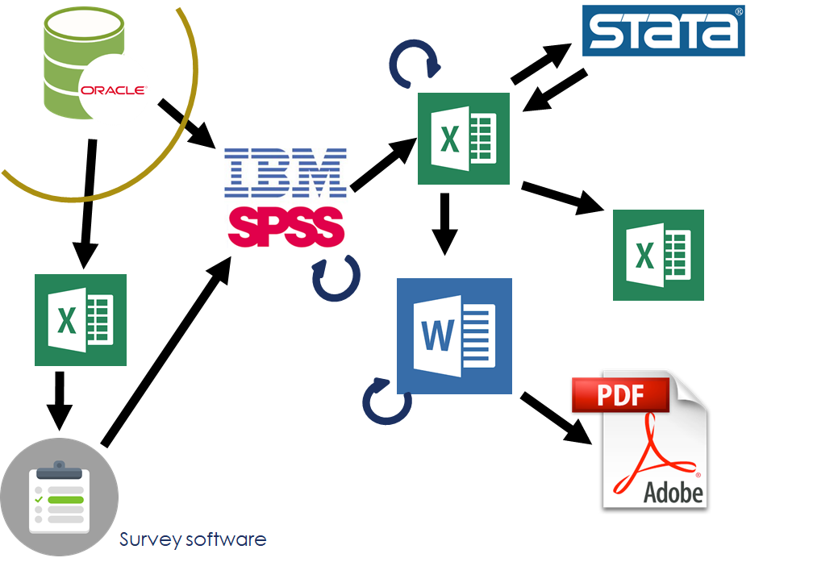
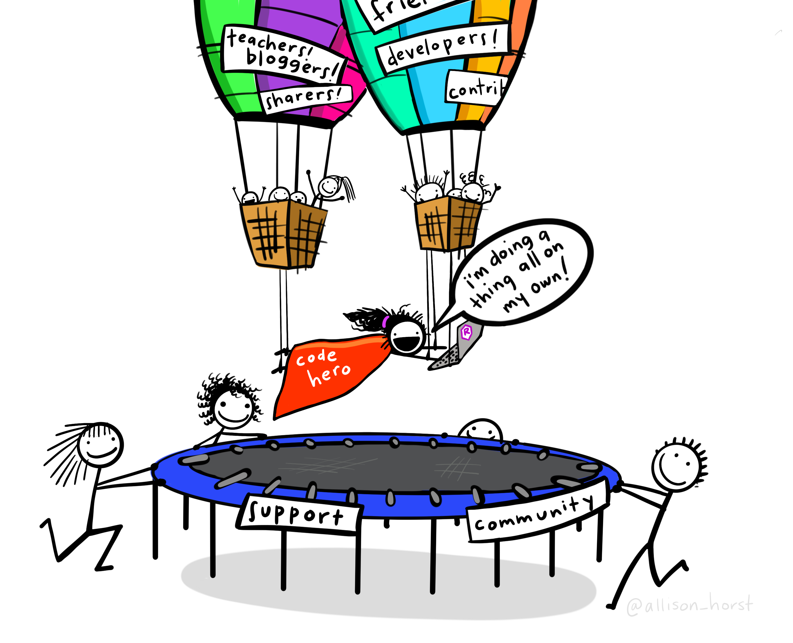
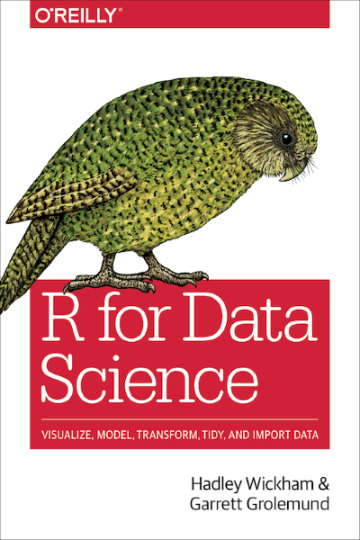

```{r setup, include=FALSE}
options(htmltools.dir.version = FALSE)
```

class: inverse

# “Statistics can be deadly dull…”

Dave Havard,
_Gardening Between the Frosts_ (1986)

???

A book about gardening in northern B.C. and the first sentence of the first chapter starts with “Statistics can be deadly dull…”

I recognize “statistics” has a bit of a reputation. But there are some _fascinating_ numbers and their associated trends that I want to talk about today.

These numbers and trends have importance for public sector decision makers, whether they are developing and evaluating policy, or striving to improve the operations of their program area.

And I hope it’s not deadly dull.


---

# BC Stats


???

BC Stats, the provincial statistics agency in British Columbia, got its start in 1894 with the passing of the Legislative Library and Statistics Bureau Act. 

We provide statistical evidence to policy makers across the government, the broader public sector (such as health administrators and school boards), businesses, and the public. We do this through analysis of existing Statistics Canada data (including the Census of Canada), administrative data collected by government agencies, and surveys that we carry out.


---

# What we do

“…collect, compile, compare, analyze, abstract, project and distribute statistical information respecting the commercial, industrial, financial, social, economic and general activities and conditions of British Columbia and persons in British Columbia or doing business in British Columbia”
–Statistics Act, section 5

???

British Columbia Statistics Act, section 5

http://www.bclaws.ca/civix/document/id/complete/statreg/96439_01#section5

---

## The Canadian National Statistical System

“The objective of national statistical systems is to provide relevant, comprehensive, accurate and objective (politically untainted) statistical information.”
Ivan Fellegi, Chief Statistician of Canada from 1985-2008

???

Ivan Fellegi, “Characteristics of an Effective Statistical System”
International Statistical Review / Revue Internationale de Statistique
Vol. 64, No. 2 (Aug., 1996), pp. 165-187
Published by: International Statistical Institute (ISI)
DOI: 10.2307/1403738
https://www.jstor.org/stable/1403738


Shaida Badiee, Johannes Jütting, Deirdre Appel, Thilo Klein and Eric Swanson
“The role of national statistical systems in the data revolution”
Development Co-operation Report 2017; Data for Development; © OECD 2017
https://www.oecd-ilibrary.org/docserver/dcr-2017-8-en.pdf?expires=1578509507&id=id&accname=guest&checksum=30ABDF52E29B4552C6AA3D945352839B


---

the data science process


---

# Why code?


## Reproducible workflow

>Saves time,
>Produces better science,
>Creates more trusted research,
>Reduces the risk of errors, and
>Encourages collaboration.
- David Smith, [Reproducible Data Science with R](https://blog.revolutionanalytics.com/2017/04/reproducible-data-science-with-r.html)

???

David Smith, 2017-04-21, [Reproducible Data Science with R](https://blog.revolutionanalytics.com/2017/04/reproducible-data-science-with-r.html)

Hilary Parker, [“Opinionated Analysis Development”](https://peerj.com/preprints/3210/), 2017-08-31

* Reproducible and Auditable

* Accurate

* Collaborative


---

# Workflow and functionality: 1



---

# Workflow and functionality: 2


---



???

Twitter: #rstats

R-bloggers.com

Meetup groups 

RLadies

Reading:

Julia Stewart Lowndes, 2019-12-10, [Open Software Means Kinder Science](https://blogs.scientificamerican.com/observations/open-software-means-kinder-science/), _Scientific American_ blog

---


Base R

* a data science / statistics programming language

* built-in analytic functions


---

# packages

Packages extend the functionality of R

* statistical and data analysis

* data visualization

* data


---


---


# RStudio

IDE (interactive development environment)

* also the company that developed and supports the IDE

* RStudio is also active creating and supporting packages, including...


---

# The Tidyverse


???

Image source: https://github.com/rstudio/hex-stickers (for all tidyverse hex images)

---


# {tidyverse}

"The tidyverse is an opinionated collection of R packages designed for data science. All packages share an underlying design philosophy, grammar, and data structures."

The [{tidyverse} site](https://tidyverse.org): tidyverse.org


---

# An analogy...

Base R is like the engine and frame of a car


---

..the packages are the other things that enhance the car's functions


---

...and RStudio is the dashboard and controls


---

(more like this)


---

(dark mode!)


---

class: inverse

# EXAMPLES


---

## math

* linear & matrix algebra

* quadratic equations

* geometry (sine, cosine, tangent)

???

https://en.wikibooks.org/wiki/R_Programming/Mathematics

---

## math: probability

winning the 6/49 lottery

```{r}

factorial(49) / (factorial(6) * factorial(49-6))

```

???

http://garsia.math.yorku.ca/~zabrocki/math5020f03/lot649/lot649v3.pdf

---

## math: plots

```{r}

curve(x^2, from = -10, to = 10, main = "x^2")

```


???

https://towardsdatascience.com/overview-of-40-mathematical-functions-in-r-4b4e138685ff

see also https://cran.r-project.org/web/views/NumericalMathematics.html

---

## math art: rose curves


???

https://en.wikipedia.org/wiki/Rose_(mathematics)

---

## math art: harmonograph

```{r}

x = A1*sin(t*f1+p1)*exp(-d1*t) + A2*sin(t*f2+p2)*exp(-d2*t)
y = A3*sin(t*f3+p3)*exp(-d3*t) + A4*sin(t*f4+p4)*exp(-d4*t)

```

???

https://en.wikipedia.org/wiki/Harmonograph

https://blog.revolutionanalytics.com/2018/04/mathematical-art-in-r-.html

https://github.com/marcusvolz/mathart


---

astronomy


???

http://www.sr.bham.ac.uk/~ajrs/R/r-gallery.html

This shows the spatial distribution of galaxies in the cluster Abell 85, using data from the NASA Extragalactic Database (NED). Overlaid are contours of kernel-smoothed number density, plotted using alpha blending (semi-transparency). Also included is an inset plot of the 1 dimensional kernel-smoothed redshift distribution, with the same colours as used in the main plot, which also serves as a key for the colour-code; the dashed curve is a Gaussian distribution with the same mean and standard deviation as the galaxy redshifts


---

wildlife tracking


???

http://www.r-gators.com/2018/01/31/wildlife-tracking-data-in-r/

More wildlife biology:

https://arxiv.org/pdf/1805.03227.pdf

https://wildlife.onlinelibrary.wiley.com/doi/pdf/10.1002/wsb.847

---

mapping—biogeoclimatic zones


???

http://www.env.gov.bc.ca/soe/indicators/land/land-designations.html

https://github.com/bcgov/land-designations-shinyapp


More R for natural resources:
https://www.nps.gov/im/statistics.htm

https://sites.google.com/site/r4naturalresources/

---

social geography

https://walkerke.shinyapps.io/neighborhood_diversity/#explore-metros


---

economy of B.C.—retail sales


???

Stephanie's shiny app


---

B.C. population: 1971


---

B.C. population: 2016


---

B.C. population: 1971 to 2016

---

class: inverse

# RStudio Cloud

Web-based version of R & RStudio

[Link](https://rstudio.cloud/spaces/34702/join?access_code=lr5keQ5WXcZ5ENNAZoLEAmPSQHav8seVNT2j36e%2F) (but will be invitation-only after today's class)

* later today, we'll run through the steps to install R on your own computer


---
class: inverse


# Text book

.pull-left[

Hadley Wickham & Garrett Grolemund, _R for Data Science_

* website: [r4ds.had.co.nz](https://r4ds.had.co.nz/)
]

.pull-right[


]

---
class: inverse


## Collaboration & community

IRL we work together

"To teach is to learn twice"

The R user community:

* welcoming & non-judgemental

* twitter #rstats

* in-person: conferences & user groups

* RLadies

* hex stickers!


---
class: inverse


## About me


* UVic Geography B.Sc. & M.A.

* BC Stats: 1993–present (with 5 year gap)

* writing code 
  - first programming course in 1979/80
  - to do data analysis since 1993
  - using R since 2012


